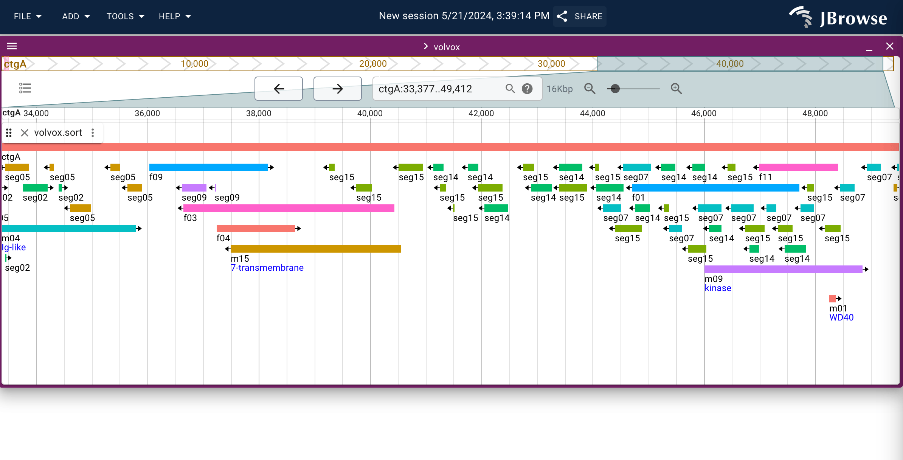

# jbrowse-plugin-feature-palette

Generates a palette for features sharing the same name. Uses a ggplot2 color
scheme and cycles colors also

## Screenshot

## Notes

Proof of concept

Colors change when you scroll

Features with subfeatures aren't colored correctly, just for box features
